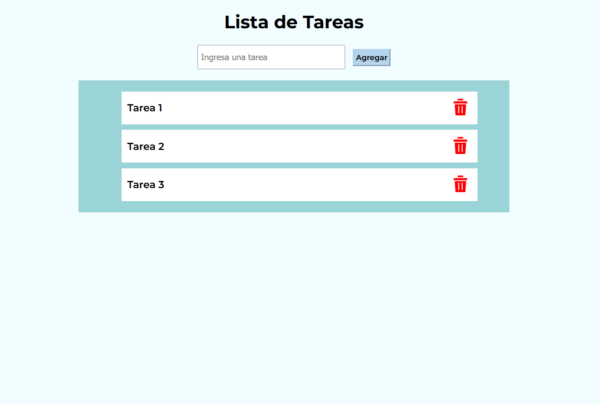
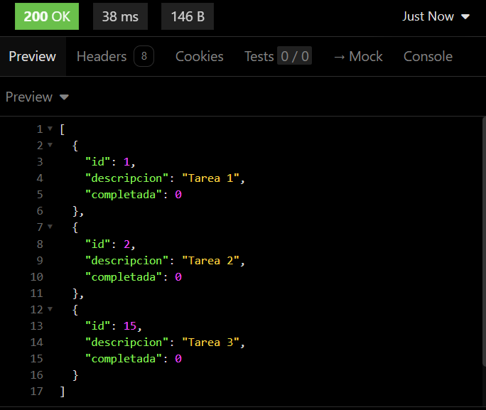
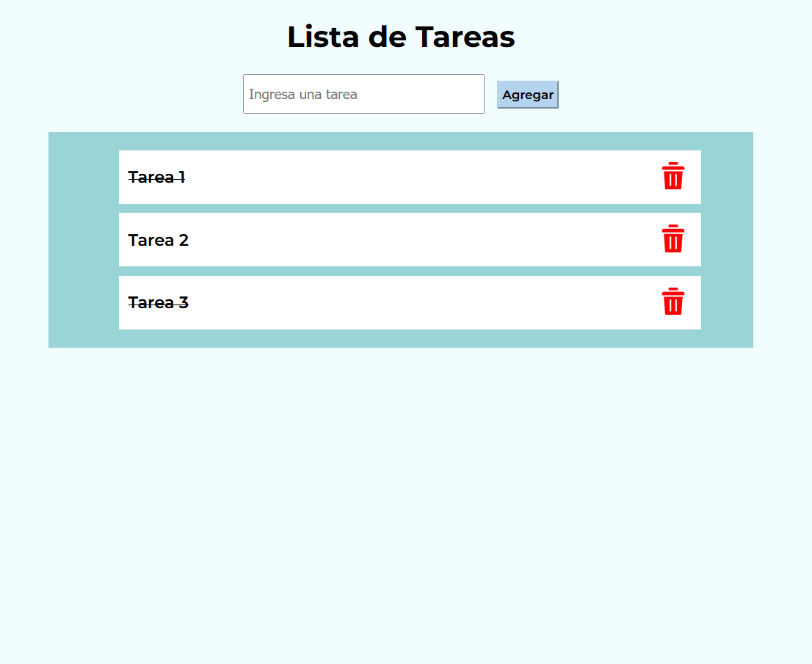
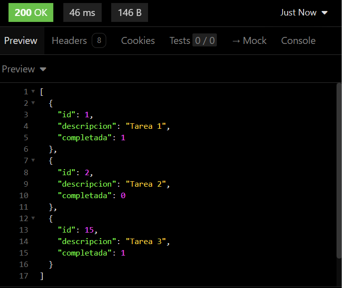
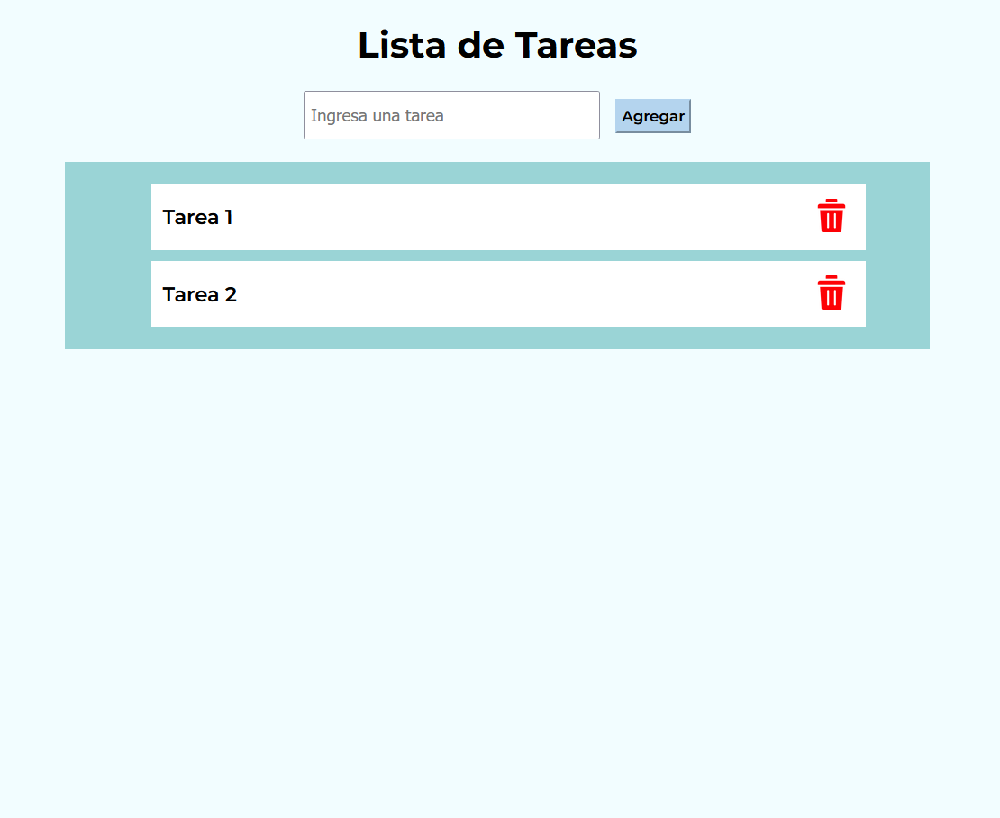
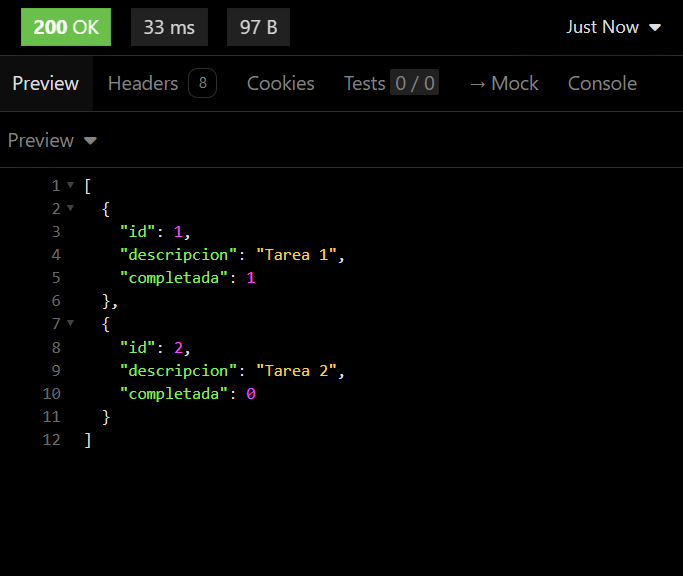

# Lista de Tareas - SQLite

<h3>Trabajo 04 - Programación para Internet</h3>

<h4>Datos</h4>

* Alumno: Ochoa Díaz Raúl Francisco.
* Código: 220790776

<h4>Descripción</h4>

Actualización de la lista de tareas que implementa almacenamiento persistente utilizando una base de datos de SQLite. Además, se creó un servidor con Node.js que permite consumir la BD desde el cliente.

<h4>Instrucciones de Ejecución</h4>

<h5>Backend</h5>

1. Descargar y configurar Node.js en el equipo.

2. Colocarse dentro de la carpeta ```backend``` 

3. Instalar las dependencias.

```
npm install
```

4. Levantar el servidor.

```
npm run dev
```

<h5>Frontend</h5>

1. Colocarse dentro de la carpeta ```frontend``` 

2. Abrir el archivo ```index.html``` dentro de un navegador.

<h4>Imágenes</h4>

Al agregar una tarea a la lista, esta es automaticamente agregada a la base de datos de forma que el registro se vuelve persistente. Esto se realiza mediante una petición POST.



Si consultamos el backend, obtenemos todos los registros guardados en la BD en formato JSON mediante una petición GET.



Cuando se tacha una tarea para marcarla como completada, se envia una petición PATCH al backend junto a un parámetro, que corresponde al ID del registro a modificar.



Al consultar el backend, vemos que la propiedad ```completada``` de las tareas tachadas ha cambiado de 0 a 1.



Finalmente, la eliminación se realiza a través del botón de cada tarea. Este envia una petición DELETE al backend junto al ID del registro.



Si volvemos a consultar el backend, vemos que el registro ha desaparecido.


